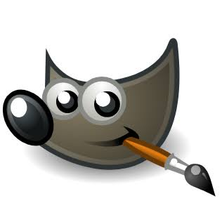

<div align="center">

# 👋 Hey, I'm Bryan Furquim

### 💻 Developer in Progress · Full-Stack Journey


<br/>

[](https://github.com/BryanFurquim)

[](https://www.instagram.com/bryanfq19/)

[](mailto:bryanfurquimm@gmail.com)

</div>

---

## 🧑‍💻 About Me

I'm a **Developer in Progress** focused on continuously improving my skills in **Web Development**.

I enjoy understanding how technologies work together, experimenting with new concepts and turning what I learn into practical projects.

My current journey is focused on **programming fundamentals, web development, databases, development tools and infrastructure**.

I'm currently learning and practicing technologies such as **HTML, CSS, JavaScript, React, PHP, Node.js, MySQL, Supabase, Python and Docker**, while continuing to strengthen my programming fundamentals.

My long-term goal is to keep learning, deepen my technical knowledge and become a **strong and well-rounded Full-Stack Developer** capable of building complete, useful and maintainable software solutions.

> 🚀 **Learn deeply. Build consistently. Keep improving.**

---

# 🛠️ Tech Stack

## 🎨 Front-End

<p>
  
</p>

`HTML5` · `CSS3` · `JavaScript` · `React`

---

## ⚙️ Back-End

<p>
  
</p>

`Node.js` · `JavaScript` · `PHP` · `Python`

---

## 🗄️ Database

<p>
  
</p>

`MySQL` · `Supabase`

---

## 🐳 Development & Infrastructure

<p>
  
</p>

`Docker`

---

## 🔧 Version Control

<p>
  
</p>

`Git` · `GitHub`

---

## 🗄️ Database Tools

<p>
  
</p>

`Beekeeper Studio`

---

## 🎨 Design & Image Editing

<p>
  
</p>

`GIMP`

---

## 💻 Operating Systems

<p>
  
</p>

`Windows` · `Linux`

> 📚 This stack represents technologies and tools I'm currently learning, practicing or using throughout my development journey.

---

# 🚀 Featured Projects

I'm currently building and publishing projects as part of my development journey.

---

## 🔐 Responsive Login

A responsive login interface created to practice **HTML5, CSS3 and responsive layouts** across different screen sizes.

**Tech:** `HTML5` `CSS3`

🌐 **[Live Demo](https://bryanfurquim.github.io/projeto-login/)**

---

## 🤖 Android Website

A website developed to strengthen my **HTML5 and CSS3 fundamentals**, focusing on structure, content organization, images, links and visual styling.

**Tech:** `HTML5` `CSS3`

🌐 **[Live Demo](https://bryanfurquim.github.io/projeto-android/)**

---

## 📱 Social Media — Iframe Practice

An educational project created to practice **HTML5 iframes, navigation, target links and interaction between multiple HTML documents**.

This project was developed as part of my studies based on **Curso em Vídeo by Gustavo Guanabara**.

**Tech:** `HTML5` `CSS3`

🌐 **[Live Demo](https://bryanfurquim.github.io/projeto-redes-sociais/)**

---

# 🎯 Current Learning Focus

<div align="center">

| Area | Focus |
| :--- | :--- |
| 🌐 **Web Development** | HTML5 · CSS3 · JavaScript |
| ⚛️ **Front-End** | JavaScript · React |
| ⚙️ **Back-End** | Node.js · JavaScript · PHP · Python |
| 🗄️ **Database** | MySQL · Supabase |
| 🐳 **Infrastructure** | Docker |
| 🔧 **Version Control** | Git · GitHub |
| 🗄️ **Database Tools** | Beekeeper Studio |
| 🎨 **Design** | GIMP |
| 💻 **Operating Systems** | Windows · Linux |

</div>

I'm continuously expanding my knowledge through **study, experimentation and practical projects**.

---

# 📈 My Development Philosophy

```text
Learn
  ↓
Practice
  ↓
Build
  ↓
Make mistakes
  ↓
Understand
  ↓
Improve
  ↓
Repeat
