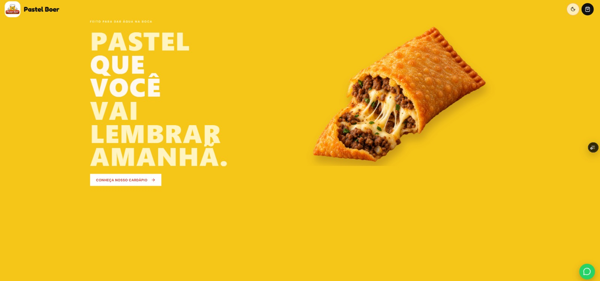
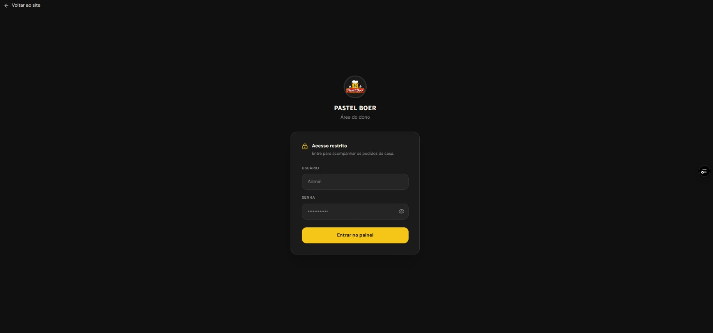
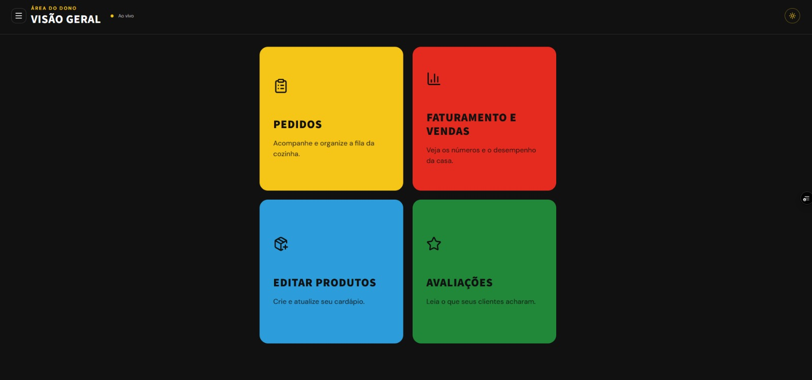
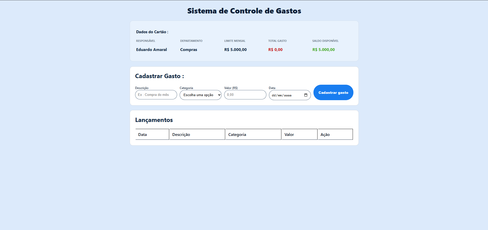
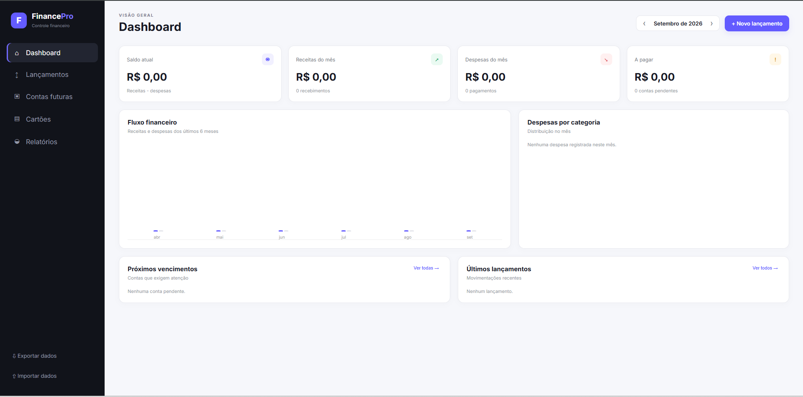
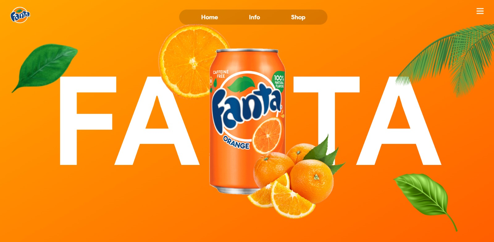
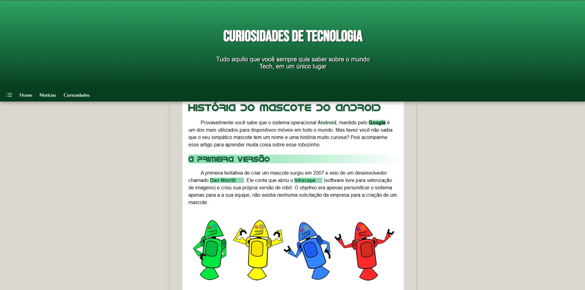

# 👋 Hey, I'm Bryan Furquim

### 💻 Developer in Progress · Full-Stack Journey

 

---

## 🧑‍💻 About Me

I'm a **Developer in Progress** focused on continuously improving my skills in **Web Development**.

I enjoy understanding how technologies work together, experimenting with new concepts and turning what I learn into practical projects.

My current journey is focused on **programming fundamentals, web development, databases, development tools, infrastructure and AI-assisted development workflows**.

I'm currently learning and practicing technologies such as **HTML, CSS, JavaScript, TypeScript, PHP, React, Next.js, MySQL, Supabase and Docker**, while also exploring **Vibe Coding** with tools such as **V0, Codex and Higgsfield**.

I've also been exploring projects involving **financial systems, Open Finance concepts, business management and real-world ordering systems**, building practical solutions based on real use cases.

My long-term goal is to keep learning, deepen my technical knowledge and become a **strong and well-rounded Full-Stack Developer** capable of building complete, useful and maintainable software solutions.

> 🚀 **Learn deeply. Build consistently. Keep improving.**

---

# 🛠️ Tech Stack

## 🎨 Front-End

  

`HTML5` · `CSS3` · `JavaScript` · `TypeScript`

---

## 🧩 Frameworks & Libraries

  

`React` · `Next.js`

---

## ⚙️ Back-End

  

`JavaScript` · `TypeScript` · `PHP`

---

## 🗄️ Database

  

`MySQL` · `Supabase`

---

## 🐳 Development & Infrastructure

  

`Docker`

---

## 🔧 Version Control

  

`Git` · `GitHub`

---

## 🗄️ Database Tools

  

`Beekeeper Studio`

---

## 🎨 Design & Image Editing

  

`GIMP`

---

## 🤖 Vibe Coding & AI Tools

  
  
  

`V0` · `Codex` · `Higgsfield`

> 🧠 Exploring **Vibe Coding** to develop **simple, functional and modern websites with the help of AI**, turning ideas into working interfaces and practical projects.

---

## 💻 Operating Systems

  

`Windows` · `Linux`

> 📚 This stack represents technologies and tools I'm currently learning, practicing or using throughout my development journey.

---

# 🚀 Featured Projects

I'm continuously building and publishing projects as part of my development journey.

---

## 🍽️ Pastelaria Ordering System

  

<table>
<tr>

<td width="50%" align="center">

</td>

<td width="50%" align="center">

</td>

</tr>
</table>

A complete **online ordering system designed for a pastelaria**, focused on creating a practical and modern digital ordering experience.

Customers can access the system through a **QR Code**, browse the digital menu, select products and place their orders directly through the interface.

The project also includes a separate **owner/admin area**, allowing the business to manage incoming orders and monitor the operation.

The system was developed with a focus on **real-world usability, responsive design and scalable architecture**, using **Supabase** for the database and **Vercel** for deployment.

**Tech:** `React` `JavaScript` `Supabase` `Vercel` `HTML5` `CSS3`

 

 

---

## 💳 Sistema de Controle de Gastos

A web-based system developed as an initial version for **controlling expenses made with a corporate credit card**.

The project allows users to register and organize expenses using information such as **description, category, amount and date**, while displaying the card's monthly limit, total expenses and available balance.

The project is also part of my studies in **PHP, TypeScript, MySQL and Docker**.

**Tech:** `HTML5` `CSS3` `TypeScript` `PHP` `MySQL` `Docker`

 

---

## 💰 FinancePro

A financial control and organization website created to experiment with **JavaScript and AI-assisted development**.

The project includes financial organization features and interactive elements designed to make personal finance management easier.

**Tech:** `HTML5` `CSS3` `JavaScript`

 

 

---

## 🥤 Fanta Project

A front-end project created to practice **JavaScript animations, interactions and visual effects**.

The main goal of the project was to experiment with animations and create a more dynamic user experience.

**Tech:** `HTML5` `CSS3` `JavaScript`

 

 

---

## 🔐 Responsive Login

A responsive login interface created to practice **HTML5, CSS3 and responsive layouts** across different screen sizes.

**Tech:** `HTML5` `CSS3`

 

 

---

## 🤖 Android Website

A website developed to strengthen my **HTML5 and CSS3 fundamentals**, focusing on structure, content organization, images, links and visual styling.

**Tech:** `HTML5` `CSS3`

 

 

---

## 📱 Social Media — Iframe Practice

An educational project created to practice **HTML5 iframes, navigation, target links and interaction between multiple HTML documents**.

This project was developed as part of my studies based on **Curso em Vídeo by Gustavo Guanabara**.

**Tech:** `HTML5` `CSS3`

 

 

---
