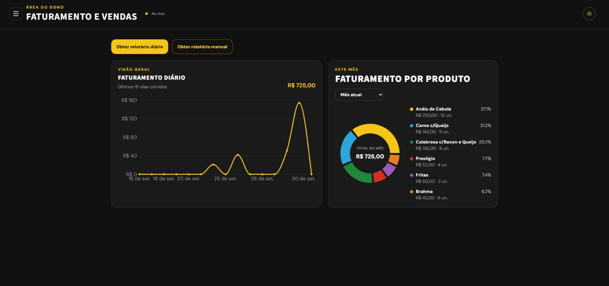

# 👋 Hey, I'm Bryan Furquim

### 💻 Developer in Progress · Full-Stack Journey

 

---
## 🧑‍💻 About Me

I'm a **Developer in Progress** focused on **Web Development and Full-Stack development**.

Currently learning and practicing **JavaScript, TypeScript, React, Next.js, PHP, MySQL, Supabase and Docker**, while exploring modern development tools and **AI-assisted workflows**.

I enjoy turning ideas into **practical, real-world projects** and continuously improving my technical skills through hands-on development.
---

# 🛠️ Tech Stack

<table>

<tr>

<td width="25%" align="center">

### 🎨 Front-End

</td>

<td width="25%" align="center">

### 🧩 Frameworks & libs

</td>

<td width="25%" align="center">

### ⚙️ Back-End

</td>

<td width="25%" align="center">

### 🗄️ Database

</td>

</tr>

<tr>

<td width="25%" align="center">

### 🐳 Development

 

</td>

<td width="25%" align="center">

### 🎨 Design

</td>

<td width="25%" align="center">

### 🤖 AI & Vibe Coding

 

</td>

<td width="25%" align="center">

### 💻 OS

</td>

</tr>

</table>

> 📚 Technologies and tools I'm currently learning, practicing or using throughout my development journey.

---

# 🚀 Featured Projects

I'm continuously building and publishing projects as part of my development journey.

---

## 🍽️ Mobile-focused ordering system for a pastelaria

  

<table>
<tr>

<td width="50%">

</td>

<td width="50%">

</td>

</tr>

<tr>

<td width="50%">

</td>

<td width="50%">

</td>

</tr>
</table>

A complete **online ordering system for a pastelaria**, featuring a QR Code digital menu, customer ordering flow and a separate admin area for managing orders.

**Admin Area:** `/admin`

**Tech:** `React` `JavaScript` `Supabase` `HTML5` `CSS3` `Nextjs`

</a>

---

<table>

<tr>

<td width="50%" valign="top" align="center">

## 💳 Sistema de Controle de Gastos

A web-based system for **organizing corporate credit card expenses**, including categories, amounts, dates, monthly limits and available balance.

**Tech:** `PHP` `TypeScript` `MySQL` `Docker`

 

</td>

<td width="50%" valign="top" align="center">

## 💰 FinancePro

A financial control website created to practice **JavaScript and interactive interfaces**.

**Tech:** `HTML5` `CSS3` `JavaScript`

 

 

</td>

</tr>

<tr>

<td width="50%" valign="top" align="center">

## 🥤 Fanta Project

A front-end project focused on **JavaScript animations, interactions and visual effects**.

**Tech:** `HTML5` `CSS3` `JavaScript`

 

 

</td>

<td width="50%" valign="top" align="center">

## 🔐 Responsive Login

A responsive login interface created to practice **HTML5, CSS3 and responsive layouts**.

**Tech:** `HTML5` `CSS3`

 

 

</td>

</tr>

<tr>

<td width="50%" valign="top" align="center">

## 🤖 Android Website

A website developed to strengthen **HTML5 and CSS3 fundamentals**, focusing on structure, content and visual styling.

**Tech:** `HTML5` `CSS3`

 

 

</td>

<td width="50%" valign="top" align="center">

## 📱 Social Media

An educational project focused on **HTML5 iframes, navigation and interaction between documents**.

**Tech:** `HTML5` `CSS3`

 

 

</td>

</tr>

</table>

🚀 Always Learning. Always Building.

